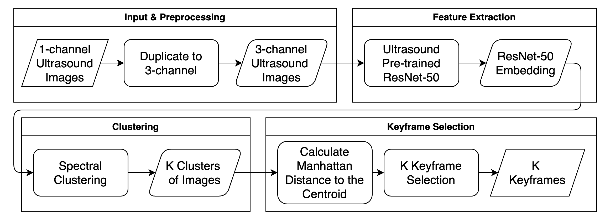

# Efficient Image Subset Selection for Ultrasound Video Frame Analysis via Spectral Clustering and Deep Feature with SonoNet Integration


## Overview



This project aims to efficiently select a representative subset of frames (keyframes) from ultrasound videos for analysis. It leverages spectral clustering techniques and deep feature extraction to identify frames that capture the most significant variations and information within the video. 

This repository contains two main parts:

* **Ultrasound_Image_Subset_Selection_with_SonoNet:** This folder contains the implementation for image subset selection specifically for 3-channel ultrasound video data. It integrates with SonoNet to provide a summary of each fetal standard plane scan from SonoNet's output. **The instructions in this README file are specific to the code and setup within this folder.**
* **Image Subset Selection for Other Datasets:** This folder contains implementations for image subset selection on other datasets, including ImageNet VID, SumMe, and ultrasound grayscale image data. **Each subfolder within this directory has its own dedicated README file with specific instructions for running the code.**


## Features (for Ultrasound_Image_Subset_Selection_with_SonoNet)

* **Spectral Clustering:** Groups similar frames together based on their deep features.
* **Deep Feature Extraction:** Uses a pre-trained ResNet50 model fine-tuned on ultrasound images to extract meaningful features.
* **Keyframe Selection:** Selects representative frames from each cluster, ensuring diversity and coverage.
* **Integration with SonoNet:** Detect and classify fetal standard scan planes.
* **Dockerized Application:** Provides a containerized environment for easy deployment and reproducibility.

## How to Build

1. **Clone the Repository:**
   ```bash
   git clone https://github.com/Wutikorn/Ultrasound_Image_Subset_Selection.git
   cd your-repository
   cd Ultrasound_Image_Subset_Selection_with_SonoNet
   ```

2. **Build the Docker Image:**
   ```bash
   docker build -t keyframe-extractor:latest .
   ```

## How to Run

1. **Prepare Your Data:**
   - Create a folder for your input ultrasound videos (e.g., `input_videos`).
   - Create a folder where you want the keyframes to be saved (e.g., `output_keyframes`).

2. **Run the Docker Container:**
   ```bash
   docker run \
     -v <path/to/input_videos>:/app/data/ultrasound_videos \
     -v <path/to/output_keyframes>:/app/data/keyframes \
     keyframe-extractor
   ```

   **Replace the following:**
   - `<path/to/input_videos>`: The path to the folder containing your input ultrasound videos.
   - `<path/to/output_keyframes>`: The path to the folder where you want the keyframes to be saved.

## Example

```bash
docker run \
  -v /path/to/my/input_videos:/app/data/ultrasound_videos \
  -v /path/to/my/output_keyframes:/app/data/keyframes \
  keyframe-extractor 
```

## Acknowledgments

* **SonoNet:** 
    - Aumgartner CF, Kamnitsas K, Matthew J, Fletcher TP, Smith S, Koch LM, et al. SonoNet: Real-Time Detection and Localisation of Fetal Standard Scan Planes in Freehand Ultrasound. Ieee Transactions on Medical Imaging. 2016;36:2204-2215. Available from: https://api.semanticscholar.org/CorpusID:3883162
* **ResNet50:** 
    - [Deep Residual Learning for Image Recognition](https://arxiv.org/abs/1512.03385) (He et al., 2015)
* **Scikit-learn:** 
    - [Machine Learning in Python](https://scikit-learn.org/stable/)
